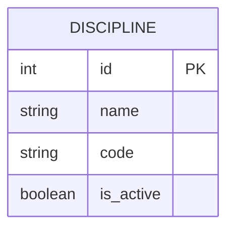

# Номер варианта и название сервиса
Вариант 11. Discipline Service (Сервис дисциплин)

## ER-диаграмма

## 1. Добавить дисциплину
Информация для создания:

| Параметр (англ.) | Пояснение | Обязательность | Тип | Ограничение | Значение по умолчанию |
| :--- | :--- | :--- | :--- | :--- | :--- |
| name | Название дисциплины | Да | String | Max 255 | - |
| code | Код дисциплины | Да | String | Max 255 | - |
| is_active | Статус активности | Нет | Boolean | - | True |

Уникальные комбинации параметров:
- Комбинация параметров name и code должна быть уникальной.

Информация при успешном создании:

| Параметр (англ.) | Тип |
| :--- | :--- |
| id | Integer |
| name | String |
| code | String |

## 2. Изменить дисциплину по ID
Информация для изменения:

| Параметр (англ.) | Пояснение | Обязательность | Тип | Ограничение |
| :--- | :--- | :--- | :--- | :--- |
| name | Новое название | Нет | String | Max 255 |
| code | Новый код | Нет | String | Max 255 |
| is_active | Новый статус | Нет | Boolean | - |

Информация при успешном изменении:

| Параметр (англ.) | Тип |
| :--- | :--- |
| id | Integer |
| status | String |

## 3. Удалить дисциплину по ID
Удаление логическое (запись не удаляется из БД физически).
В таблице БД должно быть булево поле is_active (по умолчанию True).
При удалении is_active устанавливается в False.
Возвращаемое значение: true (если запись найдена и помечена удалённой), иначе false.

## 4. Получить дисциплину по ID
Возвращаемая информация:

| Параметр (англ.) | Пояснение | Тип |
| :--- | :--- | :--- |
| id | Идентификатор дисциплины | Integer |
| name | Название дисциплины | String |
| code | Код дисциплины | String |
| is_active | Статус активности | Boolean |

## 5. Получить список дисциплин по заданным параметрам
Параметры запроса:

| Параметр (англ.) | Пояснение | Тип |
| :--- | :--- | :--- |
| name | Поиск по названию | String |
| is_active | Фильтр по статусу активности | Boolean |

Возвращаемый список:

| Параметр (англ.) | Тип |
| :--- | :--- |
| id | Integer |
| name | String |
| code | String |
| is_active | Boolean |