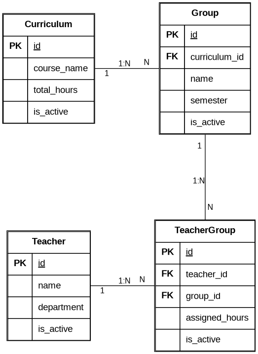

## Вариант 14. Load Calculation Service (Сервис расчета нагрузки)

### Добавить преподавателя (Teacher)

Информация требуемая для создания преподавателя

| Параметр | Пояснение | Обязательность | Тип | Ограничение | Значение по умолчанию |
|----------|-----------|----------------|-----|-------------|-----------------------|
| name | ФИО преподавателя | Обязательно | String | max 100 символов | — |
| department | Кафедра | Обязательно | String | max 50 символов | — |

Уникальные комбинации параметров отсутствуют.

Информация возвращаемая в случае удачного создания преподавателя

| Параметр | Тип |
|----------|-----|
| id | Integer |
| name | String |
| department | String |
| is_active | Boolean |

### Изменить преподавателя по ID

Информация требуемая для изменения преподавателя по ID

| Параметр | Пояснение | Обязательность | Тип | Ограничение |
|----------|-----------|----------------|-----|-------------|
| name | ФИО преподавателя | Не обязательно | String | max 100 символов |
| department | Кафедра | Не обязательно | String | max 50 символов |

Информация возвращаемая в случае удачного изменения преподавателя

| Параметр | Тип |
|----------|-----|
| id | Integer |
| name | String |
| department | String |
| is_active | Boolean |

### Удалить преподавателя по ID

Удаление реализовано через установку флага `is_active = False` (логическое удаление). Запись физически не удаляется из базы данных, а помечается как неактивная. Повторное логическое удаление не изменяет состояние записи.

**Важно:** Если преподаватель уже используется в каком-либо активном назначении (`TeacherGroup` с `is_active = True`), его удаление (деактивация) должно быть предотвращено.

Вернет `True`, если `is_active` был изменен с `True` на `False`, иначе вернет `False`.

### Получить преподавателя по ID

Возвращает информацию только об активной записи. Если запись не найдена или была логически удалена (`is_active = False`), возвращается статус 404.

| Параметр | Пояснение | Тип |
|----------|-----------|-----|
| id | ID записи | Integer |
| name | ФИО преподавателя | String |
| department | Кафедра | String |
| is_active | Статус активности записи | Boolean |

### Получить список преподавателей по заданным параметрам

По умолчанию возвращаются только активные (`is_active = True`) записи.

Информация требуемая для получения списка преподавателей

| Параметр | Пояснение | Тип |
|----------|-----------|-----|
| name | ФИО преподавателя | String |
| department | Кафедра | String |
| is_active | Фильтр по активности | Boolean |

Информация возвращается в виде списка преподавателей

| Параметр | Тип |
|----------|-----|
| id | Integer |
| name | String |
| department | String |
| is_active | Boolean |

---

### Добавить учебный план (Curriculum)

Информация требуемая для создания учебного плана

| Параметр | Пояснение | Обязательность | Тип | Ограничение | Значение по умолчанию |
|----------|-----------|----------------|-----|-------------|-----------------------|
| course_name | Название курса | Обязательно | String | max 100 символов | — |
| total_hours | Общее количество часов | Обязательно | Integer | > 0 | — |

Уникальные комбинации параметров отсутствуют.

Информация возвращаемая в случае удачного создания учебного плана

| Параметр | Тип |
|----------|-----|
| id | Integer |
| course_name | String |
| total_hours | Integer |
| is_active | Boolean |

### Изменить учебный план по ID

Информация требуемая для изменения учебного плана по ID

| Параметр | Пояснение | Обязательность | Тип | Ограничение |
|----------|-----------|----------------|-----|-------------|
| course_name | Название курса | Не обязательно | String | max 100 символов |
| total_hours | Общее количество часов | Не обязательно | Integer | > 0 |

Информация возвращаемая в случае удачного изменения учебного плана

| Параметр | Тип |
|----------|-----|
| id | Integer |
| course_name | String |
| total_hours | Integer |
| is_active | Boolean |

### Удалить учебный план по ID

Удаление реализовано через установку флага `is_active = False` (логическое удаление). Запись физически не удаляется из базы данных, а помечается как неактивная.

**Важно:** Если учебный план уже используется в какой-либо активной группе (`Group` с `is_active = True`), его удаление (деактивация) должно быть предотвращено.

Вернет `True`, если `is_active` был изменен с `True` на `False`, иначе вернет `False`.

### Получить учебный план по ID

Возвращает информацию только об активной записи. Если запись не найдена или была логически удалена (`is_active = False`), возвращается статус 404.

| Параметр | Пояснение | Тип |
|----------|-----------|-----|
| id | ID записи | Integer |
| course_name | Название курса | String |
| total_hours | Общее количество часов | Integer |
| is_active | Статус активности записи | Boolean |

### Получить список учебных планов по заданным параметрам

По умолчанию возвращаются только активные (`is_active = True`) записи.

Информация требуемая для получения списка учебных планов

| Параметр | Пояснение | Тип |
|----------|-----------|-----|
| course_name | Название курса | String |
| is_active | Фильтр по активности | Boolean |

Информация возвращается в виде списка учебных планов

| Параметр | Тип |
|----------|-----|
| id | Integer |
| course_name | String |
| total_hours | Integer |
| is_active | Boolean |

---

### Добавить группу (Group)

Информация требуемая для создания группы

| Параметр | Пояснение | Обязательность | Тип | Ограничение | Значение по умолчанию |
|----------|-----------|----------------|-----|-------------|-----------------------|
| curriculum_id | ID учебного плана | Обязательно | Integer | > 0 | — |
| name | Название группы | Обязательно | String | max 50 символов | — |
| semester | Семестр | Обязательно | Integer | от 1 до 12 | — |

Уникальная комбинация: `curriculum_id` + `name` + `semester`

Информация возвращаемая в случае удачного создания группы

| Параметр | Тип |
|----------|-----|
| id | Integer |
| curriculum_id | Integer |
| name | String |
| semester | Integer |
| is_active | Boolean |

### Изменить группу по ID

Информация требуемая для изменения группы по ID

| Параметр | Пояснение | Обязательность | Тип | Ограничение |
|----------|-----------|----------------|-----|-------------|
| curriculum_id | ID учебного плана | Не обязательно | Integer | > 0 |
| name | Название группы | Не обязательно | String | max 50 символов |
| semester | Семестр | Не обязательно | Integer | от 1 до 12 |

Информация возвращаемая в случае удачного изменения группы

| Параметр | Тип |
|----------|-----|
| id | Integer |
| curriculum_id | Integer |
| name | String |
| semester | Integer |
| is_active | Boolean |

### Удалить группу по ID

Удаление реализовано через установку флага `is_active = False` (логическое удаление). Запись физически не удаляется из базы данных, а помечается как неактивная.

**Важно:** Если группа уже используется в каком-либо активном назначении (`TeacherGroup` с `is_active = True`), её удаление (деактивация) должно быть предотвращено.

Вернет `True`, если `is_active` был изменен с `True` на `False`, иначе вернет `False`.

### Получить группу по ID

Возвращает информацию только об активной записи. Если запись не найдена или была логически удалена (`is_active = False`), возвращается статус 404.

| Параметр | Пояснение | Тип |
|----------|-----------|-----|
| id | ID записи | Integer |
| curriculum_id | ID учебного плана | Integer |
| name | Название группы | String |
| semester | Семестр | Integer |
| is_active | Статус активности записи | Boolean |

### Получить список групп по заданным параметрам

По умолчанию возвращаются только активные (`is_active = True`) записи.

Информация требуемая для получения списка групп

| Параметр | Пояснение | Тип |
|----------|-----------|-----|
| curriculum_id | ID учебного плана | Integer |
| name | Название группы | String |
| semester | Семестр | Integer |
| is_active | Фильтр по активности | Boolean |

Информация возвращается в виде списка групп

| Параметр | Тип |
|----------|-----|
| id | Integer |
| curriculum_id | Integer |
| name | String |
| semester | Integer |
| is_active | Boolean |

---

### Добавить назначение преподавателя на группу (TeacherGroup)

Информация требуемая для создания назначения преподавателя на группу

| Параметр | Пояснение | Обязательность | Тип | Ограничение | Значение по умолчанию |
|----------|-----------|----------------|-----|-------------|-----------------------|
| teacher_id | ID преподавателя | Обязательно | Integer | > 0 | — |
| group_id | ID группы | Обязательно | Integer | > 0 | — |
| assigned_hours | Назначенные часы | Обязательно | Integer | >= 0 | — |

Уникальная комбинация: `teacher_id` + `group_id`

Информация возвращаемая в случае удачного создания назначения преподавателя на группу

| Параметр | Тип |
|----------|-----|
| id | Integer |
| teacher_id | Integer |
| group_id | Integer |
| assigned_hours | Integer |
| is_active | Boolean |

### Изменить назначение преподавателя на группу по ID

Информация требуемая для изменения назначения преподавателя на группу по ID

| Параметр | Пояснение | Обязательность | Тип | Ограничение |
|----------|-----------|----------------|-----|-------------|
| teacher_id | ID преподавателя | Не обязательно | Integer | > 0 |
| group_id | ID группы | Не обязательно | Integer | > 0 |
| assigned_hours | Назначенные часы | Не обязательно | Integer | >= 0 |

Информация возвращаемая в случае удачного изменения назначения преподавателя на группу

| Параметр | Тип |
|----------|-----|
| id | Integer |
| teacher_id | Integer |
| group_id | Integer |
| assigned_hours | Integer |
| is_active | Boolean |

### Удалить назначение преподавателя на группу по ID

Удаление реализовано через установку флага `is_active = False` (логическое удаление). Запись физически не удаляется из базы данных, а помечается как неактивная.

Вернет `True`, если `is_active` был изменен с `True` на `False`, иначе вернет `False`.

### Получить назначение преподавателя на группу по ID

Возвращает информацию только об активной записи. Если запись не найдена или была логически удалена (`is_active = False`), возвращается статус 404.

| Параметр | Пояснение | Тип |
|----------|-----------|-----|
| id | ID записи | Integer |
| teacher_id | ID преподавателя | Integer |
| group_id | ID группы | Integer |
| assigned_hours | Назначенные часы | Integer |
| is_active | Статус активности записи | Boolean |

### Получить список назначений преподавателей на группы по заданным параметрам

По умолчанию возвращаются только активные (`is_active = True`) записи.

Информация требуемая для получения списка назначений преподавателей на группы

| Параметр | Пояснение | Тип |
|----------|-----------|-----|
| teacher_id | ID преподавателя | Integer |
| group_id | ID группы | Integer |
| assigned_hours | Назначенные часы | Integer |
| is_active | Фильтр по активности | Boolean |

Информация возвращается в виде списка назначений преподавателей на группы

| Параметр | Тип |
|----------|-----|
| id | Integer |
| teacher_id | Integer |
| group_id | Integer |
| assigned_hours | Integer |
| is_active | Boolean |

## ER-диаграмма

